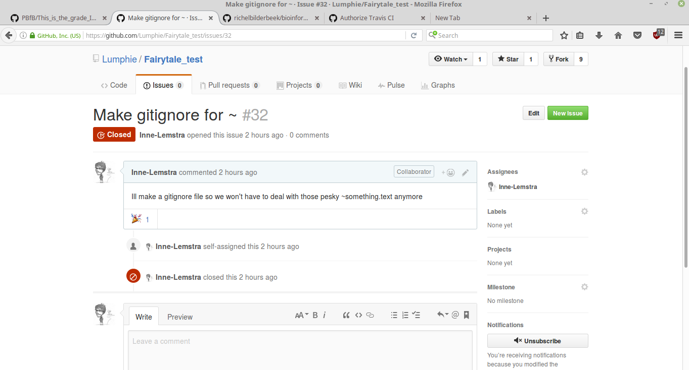

Inne Lemstra
Ik heb geen idee hoe markdown werkt dus ik ga nu wat testen

I think I deserve between a 7 and an 8. I got a good grasps of the functions of github. Interacted a lot with people offline and online and we came up with good/fun ideas. A lot of functions I already used before. But this practical give me more confidence to just play around with git(hub). I was a bit of a shame that the time frame was so short. I would have liked to aim for a 10 but I felt that this was hard given all the things you had to do. e.g. figure out travis, document report, help classmates. I would have loved a bit more time to think up cool stuff I could have done (and get travis to work).

Heb ik gedaan:

Logged in agian after a long time to github.
Avatar was still uptodate thx to gravatar
Made a new RSA key for my latop
Added a new RSA public key

followed a bunch of people
Watched some repos

Made an issue an the Fairytale repo to ask to be collaborator
Got to colaborate, sweet.

Made some changes to the story (using a pokemon go reference as message)
tried to push. Turned out lots of people working on the same time.
So commiting was annoying (lots of typing)

Created a shell script to automate commiting when called
Tried it a bit. It worked

Thought it might be easier if everyone had this. So you had less time between
Finishing writing and changing master branch. So less oportunity for other people
To change things in the main time.

Christoph send me a colaboration request for my bible reader project I once created
This was abasic project to practise R string manipulation statements, it isn't
Anything sophisticated. I don't mind him collaborating but its probably smarter to
let him fork it on his own. Lets see what he thinks about this.

Some in our Fairytail collaboration is using windows. So everytime she write a part and uses git add --all she will also commit the .txt~ which windows makes for open programs. This is annoying because now we have a lot of useless files in our repo
I openend an issue were I proposed to make a .gitignore file so files ending in ~ won't be uploaded any more. I did that and closed the issue.

Michiel wondered about the .gitignore files so I decided to give hime and example. I forked his project. added the .gitignore file and made a pull request, which he accepted. I went smooth.

Tried to play around with travis but couldn't get it to work. Its a bit daunting where to start. Maybe i'll look at it later again. Seems fun to use.

